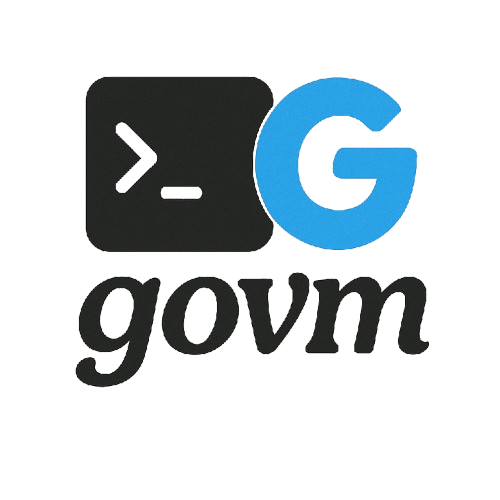

# govm - Go Version Manager 

[](https://goreportcard.com/report/github.com/emmadal/govm)
[](https://opensource.org/licenses/MIT)
[](https://github.com/emmadal/govm/releases)
[](https://github.com/emmadal/govm/issues)
[](https://github.com/emmadal/govm/stargazers)
[](https://github.com/emmadal/govm/contributors)
[](https://github.com/emmadal/govm/commits/main)


**govm** is a simple yet powerful Go version manager that allows you to seamlessly install, switch, and manage multiple Go versions on your system. Whether you're working on different projects requiring different Go versions or just need an easy way to manage your Go environment, **govm** has got you covered.

With **govm**, you can quickly install any Go version, switch between them effortlessly, and ensure your projects always run with the correct Go version. It eliminates the hassle of manually downloading, configuring, and maintaining multiple Go installations.

## 🚀 Why Use govm?

- **Effortless Installation** – Install any Go version with a single command.

- **Seamless Switching** – Easily switch between different Go versions for different projects.

- **Environment Isolation** – Avoid conflicts between Go versions across projects.

- **Lightweight & Fast** – Optimized for performance with minimal overhead.

- **Persistent Versioning** – Set and persist default Go versions globally or per project.

- **Automatic Updates** – Keep your Go environment up to date with the latest releases.

- **Cross-Platform Support** – Works on Linux and macOS (Windows support coming soon).

- **Minimal and Fast** – Lightweight with optimized performance.

- **Uninstall and Update** – Easily update or remove govm when needed.

- **Custom Go Cache Paths** – Define custom directories for Go versions.

---

## 🛠️ Installation

To install `govm`, run the following command:

```bash
curl -o- https://raw.githubusercontent.com/emmadal/govm/main/scripts/install.sh | bash
```

or

```bash
wget -qO- https://raw.githubusercontent.com/emmadal/govm/main/scripts/install.sh | bash
```

---

## 🔧 Usage

### Installing a Go version

```bash
govm install <version>
```

### Using a specific Go version

```bash
govm use <version>
```

### Listing installed Go versions

```bash
govm list
```

### Removing a Go version

```bash
govm rm <version>
```

### Updating govm

You can update `govm` to the latest version using the following command:

```bash
govm update
```

---

### Uninstalling govm

We provide a command to uninstall `govm` from your system. This will remove the govm binary and all installed Go versions managed by govm. Please note that this will not remove any Go versions installed manually.

You can uninstall `govm` using the following command:

```bash
govm uninstall
```

---

## 🛠️ Requirements

- Bash 3.2 or later
- A POSIX-compliant system (Linux, macOS, etc.)

---

## 🤝 Contributing

Contributions are welcome! Please feel free to submit a Pull Request.

---

## 📝 License

This project is licensed under the MIT License - see the [LICENSE](LICENSE) file for details.

## Support

If you encounter any issues or have questions, please file an issue on the [GitHub repository](https://github.com/emmadal/govm/issues).

## Credits

- [Go](https://golang.org/)
- [cobra](https://github.com/spf13/cobra)
- [progressbar](https://github.com/schollz/progressbar)

