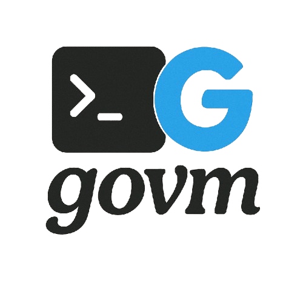

# govm - Go Version Manager 

[](https://goreportcard.com/report/github.com/emmadal/govm)
[](https://opensource.org/licenses/MIT)
[](https://github.com/emmadal/govm/releases)
[](https://github.com/emmadal/govm/issues)
[](https://github.com/emmadal/govm/stargazers)
[](https://github.com/emmadal/govm/contributors)


**govm** is a simple yet powerful Go version manager that allows you to seamlessly install, switch, and manage multiple Go versions on your system. Whether you're working on different projects requiring different Go versions or just need an easy way to manage your Go environment, **govm** has got you covered.

With **govm**, you can quickly install any Go version, switch between them effortlessly, and ensure your projects always run with the correct Go version. It eliminates the hassle of manually downloading, configuring, and maintaining multiple Go installations.

## 🚀 Why Use govm?

- **Effortless Installation** – Install any Go version, a whole minor line (`1.22`) or `latest` with a single command.

- **Instant Switching** – `govm use` repoints a single link, so the switch applies right away with no shell reload.

- **Verified Downloads** – Every Go archive is checked against the SHA-256 checksum published on go.dev.

- **Cross-Platform Support** – Works on Linux, macOS, and Windows, with no dependency on `tar`, `sed` or 7-Zip.

- **Custom Location** – Set `GOVM_DIR` to keep Go versions somewhere other than `~/.govm`.

- **Uninstall and Update** – Easily update or remove govm when needed.

---

## 🛠️ Installation

### Linux and macOS

To install `govm` on Linux or macOS, run the following command:

```bash
curl -fsSL https://raw.githubusercontent.com/emmadal/govm/main/scripts/install.sh | bash
```

or

```bash
wget -qO- https://raw.githubusercontent.com/emmadal/govm/main/scripts/install.sh | bash
```

The binary goes to `~/.local/bin` (override with `GOVM_BIN_DIR`), and a small block marked `# >>> govm >>>` is added to your shell profile to put govm and the active Go version on your `PATH`.

### Windows

To install `govm` on Windows, open PowerShell and run:

```powershell
iwr -useb https://raw.githubusercontent.com/emmadal/govm/main/scripts/install.ps1 | iex
```

---

## 🔧 Usage

Versions can be written with or without the `go` prefix (`1.22.3` or `go1.22.3`).

### Installing a Go version

Installing a version also switches to it.

```bash
govm install latest     # newest stable release
govm install 1.22       # newest 1.22.x patch release
govm install 1.21.5     # exact version
govm install 1.23rc1    # pre-release
```

### Listing available versions

```bash
govm ls-remote          # newest patch of each minor release
govm ls-remote --all    # every release, including pre-releases
```

### Switching versions

```bash
govm use 1.22.3
govm use 1.22           # newest installed 1.22.x
```

### Showing installed and active versions

```bash
govm list
govm current
```

### Removing a Go version

```bash
govm rm 1.21.5          # add --yes to skip the confirmation
```

### Updating govm

```bash
govm update
```

### Uninstalling govm

This removes the govm binary, every Go version it installed, and the lines it added to your shell profile. Go installations made outside govm are left untouched.

```bash
govm uninstall          # add --yes to skip the confirmation
```

---

## ⚙️ How it works

```
~/.govm/
├── versions/go/go1.22.3/   # one directory per installed version
├── .cache/                 # downloaded archives
└── current -> versions/go/go1.22.3
```

Only `~/.govm/current/bin` is on your `PATH`. `govm use` atomically repoints `current` (a directory junction on Windows), so every open shell sees the new version immediately.

If you installed govm before this layout existed, the first `govm use` removes the old per-version `PATH` lines from your shell profile.

---

## 🛠️ Requirements

- Linux or macOS with bash, zsh, fish or another POSIX shell
- Windows 10/11 with PowerShell 5.1 or later

---

## 🤝 Contributing

Contributions are welcome! Please feel free to submit a Pull Request.

```bash
go test ./...
golangci-lint run
```

---

## 📝 License

This project is licensed under the MIT License—see the [LICENSE](LICENSE) file for details.

## Support

If you encounter any issues or have questions, please file an issue on the [GitHub repository](https://github.com/emmadal/govm/issues).
